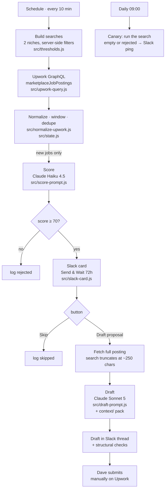

# Upwork Job Pipeline

Every ten minutes this polls Upwork's marketplace for jobs matching two niches,
scores each one with Claude against a written rubric, and posts the survivors to
Slack as a card with two buttons. Tap **Draft proposal** and it fetches the full
posting, then writes a proposal in Dave's voice using his profile and past
proposals as style anchors. Tap **Skip** and the job is logged and closed.

**Nothing is ever submitted automatically.** Every proposal is submitted by hand
on Upwork. That is a deliberate line, and it is also the actual rule: Upwork
prohibits automated proposal submission. The Slack approval tap is what keeps
this pipeline on the right side of it.

This is also the reference implementation of the service it supports —
*Claude Code + n8n | Reliable Business Automation*. The interesting logic is not
buried in an n8n canvas; it is in tested JavaScript modules in this repo, with
prompt evals and a one-command test suite.



**Why Upwork directly and not a job-alert vendor.** This started on Vollna
email alerts. Real Vollna alerts turn out to carry only title, budget, budget
type and a tracking link — no description and no client statistics — which
starves 55% of the scoring rubric. Their RSS feed adds the description but still
no client data, and their webhook/API tier that does carry it is $120/mo.
Upwork's own marketplace search returns the description, `total_spent`,
`total_hires`, `rating`, review count, payment verification and proposal count
in a single call, for free, with server-side filters that pre-cut the junk. So
the vendor layer came out entirely. `git log` has the email and RSS
implementations if you want the archaeology.

## Why the logic lives in `src/`, not in n8n

n8n Code nodes cannot import local files, which is why automation projects
usually end up with untestable JavaScript pasted into a canvas. Here the
modules are ordinary ES modules — imported normally by [vitest](https://vitest.dev),
and mechanically inlined into the node bodies by `scripts/build-workflow.mjs`
between sentinel comments. One implementation, two consumers.

The workflow JSON under `workflows/` is a **build artifact**. A logic change is:
edit `src/`, run `./test.sh`, re-import the JSON. `scripts/pull-workflow.mjs`
downloads the live workflow and diffs the inlined regions against `src/`, so a
sneaky edit in the n8n UI fails the test run instead of silently becoming the
truth.

## What is tested, offline, for free

`./test.sh` — 87 tests, no API key or n8n instance required:

| Area | What it proves |
|---|---|
| Normalizer | Real Upwork response shapes: missing `skills`, absent `proposal_count`, `budget: "0.0"` on hourly, all three `hourly_budget_type` spellings, clients with no rating or hires, country as name *or* ISO-3 code, `$25,875.82` currency strings. Every one of those branches exists because a real result exercised it. |
| Derived signals | Spend-per-hire — the signal that separates 193 hires at ~$40 each (churn) from 31 at ~$835 (real work) — and the recency window that stands in for the `created_after` filter Upwork's search API does not have. |
| State | Dedupe, the full `seen → qualified → drafted/skipped` lifecycle, the 24h canary count, and pruning that never deletes a drafted job. |
| Prompt builders | The right model per call, the rubric in the system prompt, every rubric input present in the user turn, the job kept *out* of the cached prefix, and structured-output schemas. |
| Response parsing | Structured output, tool-use output, fenced JSON, refusals, and empty responses — the last three throw rather than defaulting a score. |
| **Generated node bodies** | All ten Code nodes are compiled and executed against stubbed n8n globals: both resume paths (Draft approved / Skip), a duplicate poll, the recency window, a GraphQL error body, an empty result set, and a *failed* enrichment call that must degrade the draft rather than block it. |
| Artifact hygiene | No module syntax survives inlining, inlined regions match `src/` byte for byte, no secrets in the artifact, and the approval branch is wired the right way round. |

Plus, opt-in and costing real money:

- `./test.sh --eval` — replays `tests/evals/jobs.jsonl` through the live scoring
  prompt and prints a confusion matrix. **Gates on false negatives**, because a
  missed good job costs a paid engagement while a false positive costs a minute.
- `./test.sh --eval --drafts 3` — also drafts proposals and applies structural
  checks: length bounds, no banned generic opener, no markdown, and at least one
  distinctive term from the posting (the "one specific observation" rule,
  enforced mechanically).

## Setup

### 1. Credentials

Four credentials. Only the first costs anything.

<details>
<summary><b>Anthropic API key</b></summary>

1. `console.anthropic.com` → **Plans & Billing → Buy credits.** $5 lasts months
   at this volume. API credit is separate from a Claude subscription.
2. **API keys → Create key**, name it `upwork-pipeline`, copy it once.
3. **Limits → set a monthly cap** (~$20). Cheap insurance.

In n8n this becomes a **Header Auth** credential named `x-api-key`, not a
dedicated Anthropic credential — the workflow calls the Messages API through the
generic HTTP Request node so the request body stays owned by this repo.
</details>

<details>
<summary><b>Upwork OAuth2 app</b></summary>

Create an API app at `upwork.com/developer/apps` — free and self-service, no
approval queue.

- Name: `upwork-job-pipeline`
- Callback: `https://<your-instance>.app.n8n.cloud/rest/oauth2-credential/callback`

Put the key and secret in `.env` as `UPWORK_CLIENT_ID` / `UPWORK_CLIENT_SECRET`,
and your freelancer `org_uid` as `UPWORK_ORG_UID`. In n8n this becomes a generic
**OAuth2 API** credential so n8n owns the token refresh; the org id rides as the
`X-Upwork-API-TenantId` header on every call.

Rate limits are not a constraint here: Upwork allows 10 requests/sec per IP, and
this pipeline issues roughly 291 calls a day — about 0.003 req/sec.

Separately, Upwork's official **MCP server** (`https://mcp.upwork.com/mcp`) is
free to all users and is what this repo's fixtures were captured from. It is the
right tool for interactive work — inspecting a posting, labelling evals — while
the pipeline itself uses GraphQL, the surface meant for unattended automation.

</details>

<details>
<summary><b>Slack bot token</b></summary>

Send-and-Wait needs a bot token but **no public webhook** — n8n handles the
button callback internally, so this runs behind a home NAT with no tunnel.

1. `api.slack.com/apps` → **Create New App → From scratch**, name
   `Upwork Pipeline`.
2. **OAuth & Permissions → Bot Token Scopes**: `chat:write`,
   `chat:write.public`, `channels:read`, `files:write`.
3. **Install to Workspace**, copy the `xoxb-…` **Bot User OAuth Token**.
4. Create `#upwork-jobs` and `#upwork-jobs-test`, then `/invite @Upwork Pipeline`
   in both. Note each channel ID (`C…`) from **View channel details**.
</details>

<details>
<summary><b>n8n API key</b></summary>

**Settings → n8n API → Create an API key.** Used by the health check (to count
WF1 executions) and by the drift check. On n8n Cloud the base URL is your
instance URL; self-hosted it is `http://localhost:5678`.
</details>

### 2. Fill in `.env` and prove the credentials work

```bash
cp .env.example .env    # then fill it in; .env is gitignored
npm install
npm run verify          # real login attempt against each service, ~$0.00002
```

`verify` makes an actual Haiku call, an actual IMAP login against the
`vollna-alerts` mailbox, an actual `auth.test` against Slack, and an actual n8n
API call. Every failure it reports is far cheaper to read here than inside a
workflow execution.

### 3. Let the scripts do the wiring

```bash
npm run setup:slack                       # creates both channels, writes their ids to .env
node scripts/check-json-mode.mjs          # settles one live-API question, ~$0.001
npm run build                             # regenerate the artifacts
npm run setup:n8n -- --dry-run            # show what would happen
npm run setup:n8n -- --activate           # create credentials + workflows, cross-link, activate
```

`setup:n8n` creates the four n8n credentials, pushes all three workflows with
those credentials already attached to the right nodes, gives WF3 WF1's id and
WF1 the error workflow's id, activates both, and writes the workflow ids back to
`.env` — which is what turns on the drift check in `./test.sh`. It records ids in
`setup/.n8n-ids.json` (gitignored) so re-running updates in place instead of
creating duplicates.

### 4. Verify end to end

1. `./test.sh` — everything green.
2. Forward a real Vollna alert to the watched label. Within one IMAP poll a
   scored card appears in Slack.
3. Tap **Draft proposal** → a proposal lands in the thread in ~30s.
4. Re-send the same alert → nothing posts. Dedupe holds.
5. Tap **Skip** on the next job → no draft, no Sonnet spend.
6. Break it deliberately: change the IMAP password in n8n to something wrong,
   run WF3 by hand, confirm the "pipeline may be broken" ping fires.

## Tuning

Everything tunable is in [`src/thresholds.js`](src/thresholds.js) — the score
threshold, the approval window, draft length bounds, effort, and both model ids.
Everything Claude *reads* is in [`context/`](context/) — the rubric, the
profile, the proposal rules, and the style examples — editable without touching
a workflow.

The loop that matters: every Slack card you disagree with is a labelling
opportunity. Append it to `tests/evals/jobs.jsonl` with the verdict you would
have given, re-run the eval, and adjust the rubric until the eval agrees with
you. After ~20 real labels, delete the synthetic seed rows.

## Costs

| Item | Monthly |
|---|---|
| Upwork API + MCP | $0 |
| Job-alert vendor | **$0 — no longer needed** |
| n8n | your plan |
| Claude Haiku 4.5 — scoring | ~$0.50 |
| Claude Sonnet 5 — drafts, cached context prefix | ~$2 |
| Eval runs while tuning | ~$1 |
| Slack (existing workspace) | $0 |
| **New spend** | **~$4** |

## Known limits

- **The GraphQL field names are unverified.** The response *shape* this pipeline
  normalizes was captured from Upwork's official MCP server and is verified end
  to end; the GraphQL selection sets in `src/upwork-query.js` are composed from
  documented type names and have never been executed, because `api.upwork.com`
  needs a token. Run `node scripts/verify-upwork-graphql.mjs` before going live
  — GraphQL names every field it rejects, so a failing run is a to-do list. All
  fixes land in that one file; nothing downstream consumes the raw response.
- **The eval labels are synthetic**, seeded to cover the rubric's decision
  boundaries. They grade the prompt's consistency, not its real-world accuracy.
- **State lives in n8n's workflow static data**, so it is not queryable from
  outside n8n and is intentionally kept small. When Phase 2 needs to tune
  against real reply data, move the proposal log to SQLite on the micro PC's
  Docker volume and keep static data for dedupe only. See the note at the top of
  `src/state.js`.
- **Some n8n node parameters need confirming on first import** — particularly
  the IMAP node's field names and the Slack Send-and-Wait options, which have
  moved between node versions. The Code nodes are covered by tests; the wiring
  around them is verified by the manual smoke test above.
- **Hourly rates are invisible.** Upwork's search returns only the *kind* of
  hourly budget ("client set a range", "platform default range", "no rate
  stated"), never the numbers. The rubric is told not to speculate about a rate
  it cannot see.
- **Token refresh is the standing failure mode**, the same class of problem that
  ruled out Gmail OAuth for the old email path. If n8n's refresh ever fails, the
  pipeline goes quiet; the daily canary is what turns that into a Slack ping
  rather than a silent month.

## Layout

```
src/          logic, unit tested, inlined into Code nodes at build time
  upwork-query.js      GraphQL requests + adapter to the canonical shape
  normalize-upwork.js  search result -> canonical job
  score-prompt.js      rubric prompt (Haiku)
  draft-prompt.js      proposal prompt (Sonnet), cached context prefix
  state.js             dedupe, status lifecycle, recency high-water marks
  thresholds.js        every tunable: threshold, queries, filters, models
context/      what Claude reads: rubric, profile, proposal rules, style examples
workflows/    GENERATED n8n JSON - do not hand-edit
scripts/      build, drift check, eval harness, credential + n8n setup
tests/        unit tests, real-shape fixtures, eval labels
test.sh       one entry point
```
