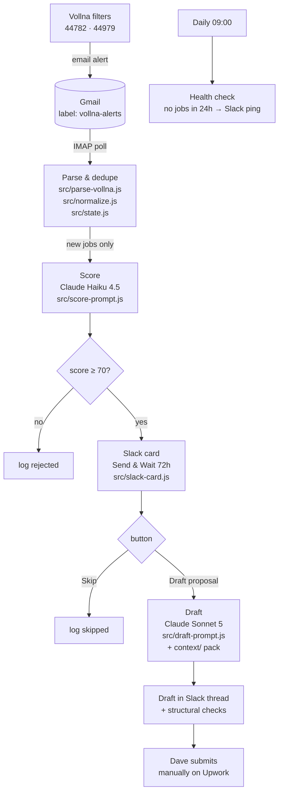

# Upwork Job Pipeline

Vollna job alerts land in Gmail. Claude scores each one against a written
rubric. Qualifying jobs arrive in Slack as a card with two buttons. Tap
**Draft proposal** and Claude writes one in Dave's voice, using his profile and
past proposals as style anchors. Tap **Skip** and the job is logged and closed.

**Nothing is ever submitted automatically.** Every proposal is submitted by
hand on Upwork. That is a deliberate line: auto-bidding is against Upwork's
terms, and a human decision is the point of the design, not a limitation of it.

This is also the reference implementation of the service it supports —
*Claude Code + n8n | Reliable Business Automation*. The interesting logic is not
buried in an n8n canvas; it is in tested JavaScript modules in this repo, with
prompt evals and a one-command test suite.



## Why the logic lives in `src/`, not in n8n

n8n Code nodes cannot import local files, which is why automation projects
usually end up with untestable JavaScript pasted into a canvas. Here the
modules are ordinary ES modules — imported normally by [vitest](https://vitest.dev),
and mechanically inlined into the node bodies by `scripts/build-workflow.mjs`
between sentinel comments. One implementation, two consumers.

The workflow JSON under `workflows/` is a **build artifact**. A logic change is:
edit `src/`, run `./test.sh`, re-import the JSON. `scripts/pull-workflow.mjs`
downloads the live workflow and diffs the inlined regions against `src/`, so a
sneaky edit in the n8n UI fails the test run instead of silently becoming the
truth.

## What is tested, offline, for free

`./test.sh` — 87 tests, no API key or n8n instance required:

| Area | What it proves |
|---|---|
| Parser fixtures | Single alerts, three-job digests, missing budgets, malformed bodies, and garbage all parse to the right fields or to `[]` — never a throw. |
| Normalizer | Canonical shape, idempotency, and a stable `job_id` across re-sends of the same posting. |
| State | Dedupe, the full `seen → qualified → drafted/skipped` lifecycle, the 24h canary count, and pruning that never deletes a drafted job. |
| Prompt builders | The right model per call, the rubric in the system prompt, every rubric input present in the user turn, the job kept *out* of the cached prefix, and structured-output schemas. |
| Response parsing | Structured output, tool-use output, fenced JSON, refusals, and empty responses — the last three throw rather than defaulting a score. |
| **Generated node bodies** | Every Code node is compiled and executed against stubbed n8n globals, including **both resume paths** (Draft approved / Skip), duplicate alerts, and the no-jobs case. |
| Artifact hygiene | No module syntax survives inlining, inlined regions match `src/` byte for byte, no secrets in the artifact, and the approval branch is wired the right way round. |

Plus, opt-in and costing real money:

- `./test.sh --eval` — replays `tests/evals/jobs.jsonl` through the live scoring
  prompt and prints a confusion matrix. **Gates on false negatives**, because a
  missed good job costs a paid engagement while a false positive costs a minute.
- `./test.sh --eval --drafts 3` — also drafts proposals and applies structural
  checks: length bounds, no banned generic opener, no markdown, and at least one
  distinctive term from the posting (the "one specific observation" rule,
  enforced mechanically).

## Setup

### 1. Credentials

Four credentials. Only the first costs anything.

<details>
<summary><b>Anthropic API key</b></summary>

1. `console.anthropic.com` → **Plans & Billing → Buy credits.** $5 lasts months
   at this volume. API credit is separate from a Claude subscription.
2. **API keys → Create key**, name it `upwork-pipeline`, copy it once.
3. **Limits → set a monthly cap** (~$20). Cheap insurance.

In n8n this becomes a **Header Auth** credential named `x-api-key`, not a
dedicated Anthropic credential — the workflow calls the Messages API through the
generic HTTP Request node so the request body stays owned by this repo.
</details>

<details>
<summary><b>Gmail app password (IMAP)</b></summary>

Chosen over the Gmail OAuth node on purpose: OAuth for a self-hosted n8n needs
a Google Cloud project, and while its consent screen is in "Testing" Google
expires the refresh token every 7 days. An app password has neither problem.

1. `myaccount.google.com/security` → enable **2-Step Verification** (required
   before app passwords exist).
2. `myaccount.google.com/apppasswords` → create one named `n8n-upwork-pipeline`,
   copy the 16 characters.
3. Gmail settings → **Forwarding and POP/IMAP** → **Enable IMAP**.
4. Gmail → search `from:(vollna.com)` → **Create filter** → apply label
   `vollna-alerts`. The IMAP trigger watches that label, not the whole inbox.

n8n IMAP credential: host `imap.gmail.com`, port `993`, TLS on, user = the full
address, password = the app password. Set the node's mailbox to `vollna-alerts`.
</details>

<details>
<summary><b>Slack bot token</b></summary>

Send-and-Wait needs a bot token but **no public webhook** — n8n handles the
button callback internally, so this runs behind a home NAT with no tunnel.

1. `api.slack.com/apps` → **Create New App → From scratch**, name
   `Upwork Pipeline`.
2. **OAuth & Permissions → Bot Token Scopes**: `chat:write`,
   `chat:write.public`, `channels:read`, `files:write`.
3. **Install to Workspace**, copy the `xoxb-…` **Bot User OAuth Token**.
4. Create `#upwork-jobs` and `#upwork-jobs-test`, then `/invite @Upwork Pipeline`
   in both. Note each channel ID (`C…`) from **View channel details**.
</details>

<details>
<summary><b>n8n API key</b></summary>

**Settings → n8n API → Create an API key.** Used by the health check (to count
WF1 executions) and by the drift check. On n8n Cloud the base URL is your
instance URL; self-hosted it is `http://localhost:5678`.
</details>

Then:

```bash
cp .env.example .env    # fill in the four values; .env is gitignored
npm install
./test.sh
```

### 2. Build and import

```bash
node scripts/check-json-mode.mjs        # settles one live-API question, ~$0.001
node scripts/build-workflow.mjs \
  --n8n-base-url https://YOUR.app.n8n.cloud \
  --slack-channel C0123456789
```

Import each file in `workflows/` into n8n (**Workflows → ⋯ → Import from
File**), then in the n8n UI:

1. Attach the four credentials to the nodes marked `REPLACE_ME`.
2. In **WF3**, set the `workflowId` query parameter to WF1's id.
3. In **Settings → Error Workflow**, select `WF-error — Failure ping`.
4. Fill `N8N_WF1_ID` and `N8N_WF3_ID` in `.env` so the drift check activates.

### 3. Verify end to end

1. `./test.sh` — everything green.
2. Forward a real Vollna alert to the watched label. Within one IMAP poll a
   scored card appears in Slack.
3. Tap **Draft proposal** → a proposal lands in the thread in ~30s.
4. Re-send the same alert → nothing posts. Dedupe holds.
5. Tap **Skip** on the next job → no draft, no Sonnet spend.
6. Break it deliberately: change the IMAP password in n8n to something wrong,
   run WF3 by hand, confirm the "pipeline may be broken" ping fires.

## Tuning

Everything tunable is in [`src/thresholds.js`](src/thresholds.js) — the score
threshold, the approval window, draft length bounds, effort, and both model ids.
Everything Claude *reads* is in [`context/`](context/) — the rubric, the
profile, the proposal rules, and the style examples — editable without touching
a workflow.

The loop that matters: every Slack card you disagree with is a labelling
opportunity. Append it to `tests/evals/jobs.jsonl` with the verdict you would
have given, re-run the eval, and adjust the rubric until the eval agrees with
you. After ~20 real labels, delete the synthetic seed rows.

## Costs

| Item | Monthly |
|---|---|
| Vollna (already paid) | $24 |
| n8n, self-hosted | $0 |
| Claude Haiku 4.5 — scoring | ~$0.50 |
| Claude Sonnet 5 — drafts, cached context prefix | ~$2 |
| Eval runs while tuning | ~$1 |
| Slack (existing workspace) | $0 |
| **New spend** | **~$4** |

## Known limits

- **The parser fixtures are synthetic.** They were written to the *shape* of a
  Vollna alert, not captured from one. Before trusting a score, save a real
  alert into `tests/fixtures/`, add its expectations, and retune
  `FIELD_PATTERNS` in `src/parse-vollna.js`. See `tests/fixtures/README.md`.
- **The eval labels are synthetic too**, seeded to cover the rubric's decision
  boundaries. They grade the prompt's consistency, not its real-world accuracy.
- **State lives in n8n's workflow static data**, so it is not queryable from
  outside n8n and is intentionally kept small. When Phase 2 needs to tune
  against real reply data, move the proposal log to SQLite on the micro PC's
  Docker volume and keep static data for dedupe only. See the note at the top of
  `src/state.js`.
- **Some n8n node parameters need confirming on first import** — particularly
  the IMAP node's field names and the Slack Send-and-Wait options, which have
  moved between node versions. The Code nodes are covered by tests; the wiring
  around them is verified by the manual smoke test above.
- **Email parsing is inherently fragile.** The v2 fix is a structured webhook
  source (e.g. Vibeworker Pro, $19/mo) — a single trigger-node swap. Until
  then, the daily health check is what turns a silent parser failure into a
  Slack ping.

## Layout

```
src/          logic, unit tested, inlined into Code nodes at build time
context/      what Claude reads: rubric, profile, proposal rules, style examples
workflows/    GENERATED n8n JSON - do not hand-edit
scripts/      build, drift check, eval harness, live-API probe
tests/        unit tests, parser fixtures, eval labels
test.sh       one entry point
```
