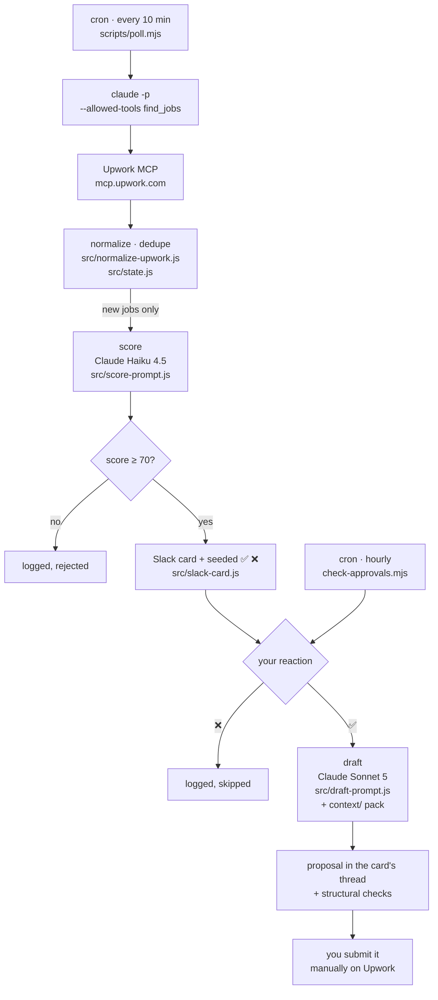

# Upwork Job Pipeline

Polls Upwork's marketplace for jobs matching two niches, scores each one with
Claude against a written rubric, and posts the survivors to Slack. React ✅ on a
card and a proposal is drafted in that thread, in Dave's voice, using his
profile and past proposals as style anchors. React ❌ and it's logged and closed.

**Nothing is ever submitted automatically.** Every proposal is submitted by hand
on Upwork. That's a deliberate line and it's also the actual rule — Upwork
prohibits automated proposal submission — so the approval step is the
compliance mechanism, not a nicety.



## How it got here

Three iterations, each killed by a fact rather than a preference — the commit
history has all of it.

1. **Vollna email alerts.** Real alerts turned out to carry only title, budget,
   budget type and a tracking link. No description, no client statistics — which
   starves 55% of the scoring rubric.
2. **Vollna RSS**, then. Adds the description, still no client data. Their
   webhook/API tier that carries it is $120/mo.
3. **Upwork's own API, orchestrated by n8n.** Upwork's official MCP server
   (launched August 2026, free to all users) returns description, `total_spent`,
   `total_hires`, `rating`, review count, payment verification and
   `proposal_count` in one call, with server-side filters. But n8n needs its own
   OAuth identity, which needs a registered Upwork API app, which was not
   obtainable.

So discovery runs through Claude Code, which already holds an authenticated MCP
connection and needs no app registration. n8n came out; the job-source cost went
to zero.

**What n8n was actually providing**, and what replaced each piece: the schedule
(→ cron), HTTP calls (→ MCP), state (→ a JSON file — `state.js` was always pure
functions over a plain object, so it moved runtimes unchanged), Claude API calls
(→ the same modules), and the paused-workflow approval gate (→ Slack reactions,
read on a schedule). That last one was the only piece with real value, and
reactions replace it with no webhook, no interactivity endpoint and no
always-on server.

## Running it

```bash
npm install
cp .env.example .env    # fill it in
npm run verify          # real call against each service
```

Then, in order:

```bash
node scripts/poll.mjs                    # dry run: discover + score, print
node scripts/poll.mjs --post --test      # ...and post cards to #upwork-jobs-test
node scripts/check-approvals.mjs --dry-run   # see which cards you decided
node scripts/check-approvals.mjs         # draft the approved ones
```

On a schedule (`crontab -e`), while the Mac is awake:

```cron
*/10 * * * * cd ~/Developer/upwork-job-pipeline && /usr/local/bin/node scripts/poll.mjs --post >> /tmp/upwork-poll.log 2>&1
0    * * * * cd ~/Developer/upwork-job-pipeline && /usr/local/bin/node scripts/check-approvals.mjs >> /tmp/upwork-approvals.log 2>&1
```

Discovery shells out to `claude -p` with `--allowed-tools
mcp__upwork__upwork__find_jobs`, so a scheduled run can call exactly one
read-only search tool and nothing else in the Upwork account. `ANTHROPIC_API_KEY`
is stripped from that subprocess's environment on purpose: if the child sees it,
it authenticates with the key and bills API credits instead of the subscription.

## What's tested, offline, for free

`./test.sh` — 76 tests, no API key and no network:

| Area | What it proves |
|---|---|
| Normalizer | Real Upwork response shapes: missing `skills`, absent `proposal_count`, `budget: "0.0"` on hourly, all three `hourly_budget_type` spellings, clients with no rating or hires, country as name *or* ISO-3 code, `"$25,875.82"` currency strings. Every branch exists because a live response exercised it. |
| Derived signals | Spend-per-hire, which separates 592 hires at ~$9 each from 31 at ~$835, and the recency window that stands in for the `created_after` filter Upwork's search API doesn't have. |
| Prompt builders | Right model per call, rubric in the system prompt, every rubric input present in the user turn, the job kept *out* of the cached prefix, and schemas that avoid the keys structured outputs reject. |
| Response parsing | Structured output, tool-use output, fenced JSON, refusals and empty responses — the last three throw rather than defaulting a score. |
| State | Dedupe, the full `seen → qualified → drafted/skipped` lifecycle, and pruning that never deletes a drafted job. |
| Draft checks | Length bounds, banned generic openers, no markdown, at least one distinctive term from the posting (the "one specific observation" rule, enforced mechanically), and a body that ends in a complete sentence — a real draft once trailed off mid-clause with `stop_reason: end_turn`, so nothing else would have caught it. |
| Proposal header | The fixed credentials block is prepended in code, never generated: it must be verbatim every time, and it is excluded from the word count so the length bounds still bind Claude's writing. |

Plus, opt-in and costing real money: `./test.sh --eval` replays
`tests/evals/jobs.jsonl` through the live scoring prompt and prints a confusion
matrix, gating on **false negatives** — a missed good job costs a paid
engagement, a false positive costs a minute.

## Tuning

Everything tunable is in [`src/thresholds.js`](src/thresholds.js): the score
threshold, the search queries, the server-side filters, both model ids, draft
length bounds, drafting effort, and `PROPOSAL_HEADER` — the fixed credentials
block that opens every proposal. Everything Claude *reads* is in [`context/`](context/) — rubric,
profile, proposal rules, style examples — editable without touching code.

The loop that matters: every card you disagree with is a labelling opportunity.
Append it to `tests/evals/jobs.jsonl` with the verdict you'd have given, re-run
the eval, adjust the rubric until it agrees with you.

## Costs

| Item | Monthly |
|---|---|
| Upwork API + MCP | $0 |
| Job-alert vendor | $0 — not needed |
| Claude Haiku 4.5 — scoring, ~$0.0023/job | ~$2 at 30 jobs/day |
| Claude Sonnet 5 — drafts, cached context prefix | ~$1 |
| Slack | $0 |
| **Total** | **~$3** |

## Known limits

- **Drafts are written from the search snippet**, which Upwork truncates at
  ~250 characters. The draft prompt is told the text is partial and instructed
  not to invent specifics. Fetching the full posting for approved jobs is a
  `find_jobs action=get` call away and is the obvious next improvement.
- **Discovery needs an authenticated Claude Code MCP connection.** If the token
  expires, every search fails at once and `poll.mjs` says so and exits non-zero
  — re-authenticate with `/mcp` in an interactive session.
- **It needs a host with Claude Code authenticated.** Discovery shells out to
  `claude -p`, and the Upwork MCP token lives in that machine's credential
  store. The intended home is the 24/7 micro PC: install Node and Claude Code,
  authenticate the MCP once interactively, then schedule the two scripts. Any
  always-on machine works; what does not work is a runner that cannot hold an
  interactive OAuth session, so GitHub Actions and a bare VPS are out.
- **Hourly rates are invisible.** Upwork's search returns only the *kind* of
  hourly budget ("client set a range", "platform default range", "no rate
  stated"), never the numbers, and the rubric is told not to speculate.
- **The eval labels are synthetic seeds**, covering the rubric's decision
  boundaries. They grade consistency, not real-world accuracy — replace them
  with real labelled jobs as cards accumulate.

## Layout

```
src/                    logic, unit tested
  normalize-upwork.js   search result -> canonical job
  score-prompt.js       rubric prompt (Haiku)
  draft-prompt.js       proposal prompt (Sonnet), cached context prefix
  slack-card.js         card and draft rendering
  state.js              dedupe, status lifecycle
  thresholds.js         every tunable in one place
context/                what Claude reads: rubric, profile, rules, examples
scripts/
  poll.mjs              scheduled discovery + scoring + posting
  check-approvals.mjs   reactions -> drafts
  run-once.mjs          score a saved response
  run-eval.mjs          grade the scoring prompt
  verify-creds.mjs      real call against each service
  lib/pipeline.mjs      shared core: state, scoring, Slack, drafting
setup/                  Slack app manifest, local state.json (gitignored)
tests/                  unit tests, real-shape fixtures, eval labels
test.sh                 one entry point
```
